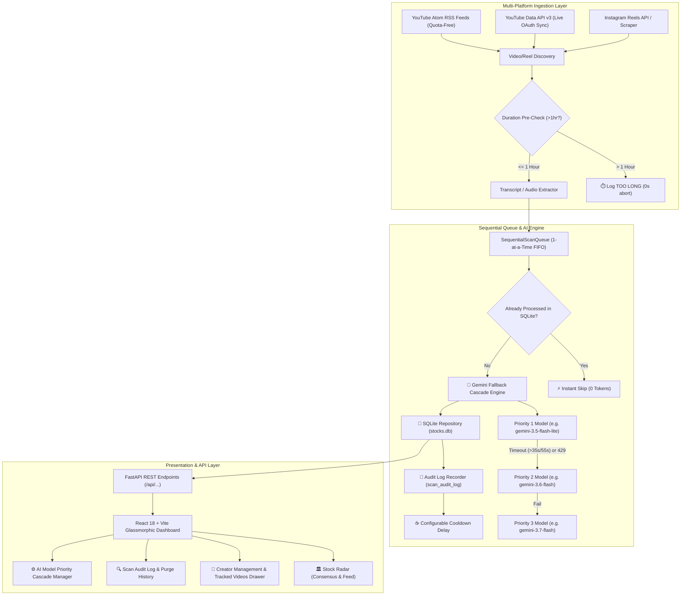

# AGENTS.md: Developer & Agent Architecture Guide for AlphaPulse

Welcome to **AlphaPulse**, an AI-powered multi-platform financial intelligence platform that monitors financial creators across **YouTube** and **Instagram Reels**, extracts structured stock recommendations, key entry levels, price targets, stop losses, and catalyst theses, and presents them in a modern React dashboard.

---

## 🏛️ System Architecture



---

## 📁 Key Files and Core Modules

| File | Purpose |
|---|---|
| [`server.py`](file:///C:/Users/kumar/.gemini/antigravity-ide/scratch/yt-stock-analyzer/server.py) | Main FastAPI application, REST endpoints, static frontend bundle hosting, and background task orchestrator. |
| [`scan_queue.py`](file:///C:/Users/kumar/.gemini/antigravity-ide/scratch/yt-stock-analyzer/scan_queue.py) | Sequential FIFO queue manager processing 1 video at a time with live progress tracking, duration pre-check, and cancel controls. |
| [`db.py`](file:///C:/Users/kumar/.gemini/antigravity-ide/scratch/yt-stock-analyzer/db.py) | SQLite database layer managing tables: `channels`, `videos`, `recommendations`, `scan_audit_log`, and `app_settings`. |
| [`analyzer.py`](file:///C:/Users/kumar/.gemini/antigravity-ide/scratch/yt-stock-analyzer/analyzer.py) | Multi-model Gemini fallback cascade engine with per-model execution timeouts (`35s` text / `55s` audio). |
| [`schema.py`](file:///C:/Users/kumar/.gemini/antigravity-ide/scratch/yt-stock-analyzer/schema.py) | Strict Pydantic models for structured output: `VideoStockSummary`, `StockRecommendation`, `MarketSentimentEnum`. |
| [`transcript_extractor.py`](file:///C:/Users/kumar/.gemini/antigravity-ide/scratch/yt-stock-analyzer/transcript_extractor.py) | Subtitle extraction, yt-dlp fast duration metadata probe, and synchronized audio fallback. |
| [`instagram_extractor.py`](file:///C:/Users/kumar/.gemini/antigravity-ide/scratch/yt-stock-analyzer/instagram_extractor.py) | Instagram Reel discovery, metadata parsing, and profile reel extractors. |
| [`channel_scanner.py`](file:///C:/Users/kumar/.gemini/antigravity-ide/scratch/yt-stock-analyzer/channel_scanner.py) | Public Atom RSS feed reader for quota-free YouTube channel video discovery. |
| [`youtube_oauth.py`](file:///C:/Users/kumar/.gemini/antigravity-ide/scratch/yt-stock-analyzer/youtube_oauth.py) | Google OAuth 2.0 handler and real-time subscription synchronization engine. |
| [`client/src/components/`](file:///C:/Users/kumar/.gemini/antigravity-ide/scratch/yt-stock-analyzer/client/src/components) | React components: `ConsensusView`, `StockCard`, `FilterBar`, `ChannelManager`, `ScanAuditLog`, `StockDetailModal`. |
| [`client/src/utils/timeUtils.js`](file:///C:/Users/kumar/.gemini/antigravity-ide/scratch/yt-stock-analyzer/client/src/utils/timeUtils.js) | Centralized Singapore Time (SGT / UTC+8) date/time formatting utilities. |

---

## 🛡️ Critical Agent Guidelines & Rules

### 1. Sequential 1-by-1 Processing & Rate-Limit Safeguards
- **Never trigger parallel concurrent video extractions**: All video scan tasks must flow sequentially through `scan_queue.py`.
- **Smart Deduplication**: Always check `db.is_video_processed(video_id)` before calling Gemini to prevent consuming redundant tokens.
- **1-Hour Duration Limit**: Videos exceeding 3,600 seconds (> 1 hour) are skipped in 0s without downloading audio or burning API quotas, recorded as `TOO LONG`.

### 2. Multi-Model Cascade & Fallback Mechanism
- Scans execute through a user-ordered cascade (e.g. `gemini-3.5-flash-lite` $\rightarrow$ `gemini-3.6-flash` $\rightarrow$ `gemini-3.7-flash`).
- Individual model calls are wrapped in strict threadpool timeouts (35s for text transcripts, 55s for audio).
- If a model times out or encounters rate limits (429), it logs a cascade notice and seamlessly attempts the next configured model in the cascade.

### 3. Strict Timezone & Date Semantics
- **Singapore Time (SGT / Asia/Singapore / UTC+8)**: All frontend dates, timestamps, and audit log entries must display in SGT.
- **Date Semantics**: In Stock Radar and Consensus Views, dates explicitly represent **Video Upload Date** (`published_at`).

### 4. Creators & Tracked Videos
- On the **Creators** tab, clicking `🎬 {N} Videos Tracked` expands an in-line drawer showing all analyzed videos for that creator strictly ordered by **Upload Date DESC (`published_at DESC`)** with clickable links and stock calls.

### 5. Audit Log & Purge History
- All scans are tracked in `scan_audit_log`.
- The **`Purge Inactive & Re-runs`** feature removes `SKIPPED`, `FAILED`, `TOO LONG`, and `RERUN PASSED` records to keep the UI clean while preserving all saved stock recommendations and consensus intelligence.

### 6. Networking, YouTube Anti-Bot & Cloud Compatibility
- **YouTube Anti-Bot Hardening**: Support cookies (`cookies.txt` or `YOUTUBE_COOKIES_CONTENT`), proxies (`YOUTUBE_PROXY`), and multi-client spoofing (`android`, `ios`, `mweb`, `web_embedded`) in `transcript_extractor.py` to prevent 429 IP blocks on Cloud Run / datacenter subnets.
- **Force IPv4 Resolution**: On Windows systems, enforce IPv4 socket resolution (`urllib3.util.connection.allowed_gai_family = lambda: socket.AF_INET`) to prevent `[WinError 10051]` unrouted IPv6 socket failures.
- **UTF-8 Output**: Enforce UTF-8 stdout encoding in background scripts to prevent Windows cp1252 character map crashes.

---

## 💻 Development & Deployment Commands

### Running Locally (Backend & Frontend Server)
```powershell
cd C:\Users\kumar\.gemini\antigravity-ide\scratch\yt-stock-analyzer
.venv\Scripts\activate
python server.py
```

### Rebuilding the React Frontend
```powershell
cd client
npm install
npm run build
```

### API Endpoints Reference
- `GET /api/recommendations` - Query stock calls with search, sentiment, channel, date filters.
- `GET /api/consensus` - Clubbed consensus radar grouped by stock ticker.
- `GET /api/stats` - Total picks, active channels, sentiment distribution.
- `GET /api/channels` - List monitored creators with analyzed video counts.
- `GET /api/channels/{id}/videos` - List all analyzed videos for a creator in upload date DESC order.
- `POST /api/channels` - Add a creator by YouTube handle or Instagram URL.
- `DELETE /api/channels/{id}` - Remove a creator from monitoring.
- `POST /api/scan` - Enqueue videos from a target creator or single video.
- `POST /api/scan-all` - Enqueue batch scan across all enabled creators.
- `GET /api/scan/status` - Live polling status for the sequential worker.
- `POST /api/queue/clear` - Stop active scan and clear queue.
- `GET /api/scan/settings` & `POST /api/scan/settings` - Configure AI model priority cascade and queue cooldown.
- `GET /api/scan/audit` - Get paginated scan audit logs and pass/fail summary metrics.
- `POST /api/scan/audit/purge` - Purge skipped, failed, too-long, and re-run history entries.
- `GET /api/auth/youtube/login` & `POST /api/auth/youtube/sync` - Live YouTube subscription OAuth sync.

