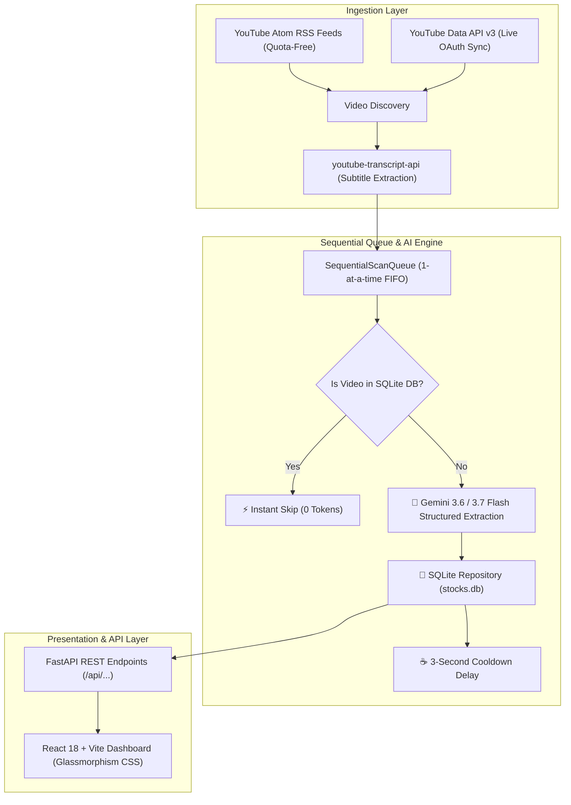

# AGENTS.md: Developer & Agent Guide for AlphaPulse

Welcome to **AlphaPulse**, an AI-powered financial intelligence and stock analysis platform that ingests video content from monitored YouTube financial creators, extracts structured stock recommendations, key entry levels, price targets, stop losses, and catalyst theses, and serves them via a modern React dashboard.

---

## 🏛️ System Architecture



---

## 📁 Key Files and Directories

| File | Purpose |
|---|---|
| [`server.py`](file:///C:/Users/kumar/.gemini/antigravity-ide/scratch/yt-stock-analyzer/server.py) | Main FastAPI application, REST endpoints, static frontend bundle hosting, and background task orchestrator. |
| [`scan_queue.py`](file:///C:/Users/kumar/.gemini/antigravity-ide/scratch/yt-stock-analyzer/scan_queue.py) | Sequential FIFO Queue manager processing 1 video at a time with live progress tracking and cancel controls. |
| [`db.py`](file:///C:/Users/kumar/.gemini/antigravity-ide/scratch/yt-stock-analyzer/db.py) | SQLite database layer managing tables: `channels`, `videos`, and `recommendations` with multi-column filtering. |
| [`analyzer.py`](file:///C:/Users/kumar/.gemini/antigravity-ide/scratch/yt-stock-analyzer/analyzer.py) | Gemini structured output extraction engine leveraging strict Pydantic schemas. |
| [`schema.py`](file:///C:/Users/kumar/.gemini/antigravity-ide/scratch/yt-stock-analyzer/schema.py) | Pydantic models for structured output: `VideoStockSummary`, `StockRecommendation`, `MarketSentimentEnum`. |
| [`transcript_extractor.py`](file:///C:/Users/kumar/.gemini/antigravity-ide/scratch/yt-stock-analyzer/transcript_extractor.py) | Fetches subtitle streams and computes synchronized timestamp anchors. |
| [`channel_scanner.py`](file:///C:/Users/kumar/.gemini/antigravity-ide/scratch/yt-stock-analyzer/channel_scanner.py) | Public Atom RSS feed reader for quota-free channel video discovery. |
| [`youtube_oauth.py`](file:///C:/Users/kumar/.gemini/antigravity-ide/scratch/yt-stock-analyzer/youtube_oauth.py) | Google OAuth 2.0 handler and real-time subscription synchronization engine. |
| [`client/`](file:///C:/Users/kumar/.gemini/antigravity-ide/scratch/yt-stock-analyzer/client) | React 18 + Vite frontend source code. |
| [`Dockerfile`](file:///C:/Users/kumar/.gemini/antigravity-ide/scratch/yt-stock-analyzer/Dockerfile) | Multi-stage production container build file. |

---

## 🛡️ Critical Agent Guidelines & Rules

### 1. Free-Tier & Rate-Limit Preservation
- **Always use Sequential 1-by-1 processing**: Never trigger parallel concurrent video extractions. All video scan tasks must flow through `scan_queue.py`.
- **Maintain 3-second cooldown**: A 3-second delay must be preserved between video completions in `scan_queue.py` to prevent triggering HTTP 429 rate limits on Google AI Studio.
- **Smart Deduplication**: Always check `db.is_video_processed(video_id)` before calling Gemini to prevent consuming redundant tokens.

### 2. Networking & Windows Compatibility
- **Force IPv4 Resolution**: On Windows systems, always enforce IPv4 socket resolution (`urllib3.util.connection.allowed_gai_family = lambda: socket.AF_INET`) to prevent `[WinError 10051]` unrouted IPv6 socket failures.
- **UTF-8 Console Reconfiguration**: Ensure `sys.stdout.reconfigure(encoding="utf-8")` is invoked on Windows to prevent `UnicodeEncodeError` when printing emojis or special characters.

### 3. Frontend & Presentation Modes
- **Consensus Radar View (`/api/consensus`)**: Groups recommendations by stock ticker to show consensus sentiment, price targets, and full creator breakdown timelines chronologically.
- **Per-Channel Fetch Limits**: Each channel allows individual depth controls (1, 2, 3, 5, 10 videos) before queuing.
- **Tracked Badges**: Visual indicator on each channel card for `X Videos Tracked` and `Y Stock Picks Extracted`.
- **No Tailwind CSS**: Use pure Vanilla CSS with design tokens defined in `client/src/index.css` (dark-mode glassmorphic aesthetics, glowing pill badges, smooth transitions).
- **Interactive Time-Jumping**: Recommendation cards and deep-dive modals preserve the `timestamp_reference` field and render clickable links in format `https://youtube.com/watch?v=VIDEO_ID&t=SECONDSs`.

### 4. Secret & Git Hygiene
- **Never commit credentials**: `.env`, `client_secret.json`, `youtube_token.json`, and `stocks.db` must remain strictly ignored in `.gitignore`.
- Ensure scripts read credentials via environment variables (`$env:GEMINI_API_KEY`, etc.) rather than hardcoded literals.

---

## 💻 Development Workflow

### Starting the Full-Stack Application
```powershell
cd C:\Users\kumar\.gemini\antigravity-ide\scratch\yt-stock-analyzer
.venv\Scripts\activate
python server.py
```

### Rebuilding the React Frontend
```powershell
cd client
npm install
npm run build
```

### API Endpoints Reference
- `GET /api/recommendations` - Query stock calls with search, sentiment, channel, market filters.
- `GET /api/consensus` - Clubbed consensus radar grouped by stock ticker.
- `GET /api/stats` - Total picks, active channels, sentiment distribution.
- `GET /api/channels` - List monitored channels with analyzed video counts.
- `POST /api/channels` - Add a new creator by YouTube handle or URL.
- `DELETE /api/channels/{id}` - Remove a creator from monitoring.
- `POST /api/scan` - Enqueue videos from a target URL with depth limit.
- `POST /api/scan-all` - Enqueue batch scan across all enabled creators.
- `GET /api/scan/status` - Live polling status for the sequential worker.
- `POST /api/queue/clear` - Stop active scan and clear queue.
- `GET /api/auth/youtube/login` - Start Google OAuth flow for YouTube subscriptions.
- `POST /api/auth/youtube/sync` - Sync YouTube subscriptions into monitored channels.

